# 💰 Salary Predictions of Data Professions 

Welcome to the Machine Learning Internship project focused on predicting the salaries of data professionals. This repository contains the code, data, and documentation for building a predictive model for salaries in the data profession domain.

## 🌐 Website

You can access the deployed application [here](https://salary-prediction-api-4n6g.onrender.com).

## 📂 Repository Structure

- 📁 `Figures/`: Contains the presentation figures for the project.
- 📁 `static/`: Static files for the Flask application, including CSS, JavaScript and images.
- 📁 `templates/`: HTML templates for the Flask application.
- 📄 `Exploratory data analysis.ipynb`: Jupyter notebook for exploratory data analysis.
- 📄 `Feature engineering and Model building.ipynb`: Jupyter notebook for feature engineering and model development.
- 📄 `Salary Predictions of Data Professions.csv`: The dataset used for the project.
- 📄 `app.py`: Flask application file for model deployment.
- 📄 `best_model.pkl`: Pickle file of the best-performing model.
- 📄 `model.py`: Script containing the model training and evaluation code.
- 📄 `requirements.txt`: List of dependencies required for the project.
- 📜 `README.md`: Project documentation.

## 🛠️ Steps Involved

### 1. 📊 Exploratory Data Analysis (EDA)

Dive into the dataset, conduct comprehensive EDA, and unveil valuable insights about data professionals' salaries. EDA involves data visualization, summary statistics, and identifying patterns in the data.

### 2. 🛠️ Feature Engineering

Create new features or transform existing ones to provide additional insights or improve model performance. Feature engineering involves deriving features related to experience, job role, and performance.

### 3. 🧹 Data Preprocessing

Prepare the data for model training. This includes handling missing values, encoding categorical variables, and scaling or normalizing features as needed.

### 4. 🤖 Machine Learning Model Development

Train various machine learning regression models to predict salaries. Experiment with different algorithms such as:
- 📈 Linear Regression
- 🌳 Decision Trees
- 🌲 Random Forests
- 🚀 Gradient Boosting
- 🤝 K-Nearest Neighbors (KNN)
- 🌟 Extra Trees Regression

### 5. 🧮 Model Evaluation

Assess the performance of your models using appropriate evaluation metrics like:
- 📉 Mean Squared Error (MSE)
- 📈 R-Squared (R2) Score

Identify the model that provides the most accurate salary predictions. In this project, Gradient Boosting was found to be the best-performing model based on MSE and R2 score.

### 6. 🚀 ML Pipelines and Model Deployment

Create ML Pipelines to streamline the end-to-end machine learning process, from data preprocessing to model training. Deploy the model using Flask and host it on Render cloud service for generating predictions for unseen data.

### 7. 📊 Recommendations

The most influencing features of salary of the data professionals are
- Age
- {Date of joining, Current date, Past experience} - Overall Experience
- Designation
I recommend gaining experience in data related field will secure a good paying role

## Project Presentation 
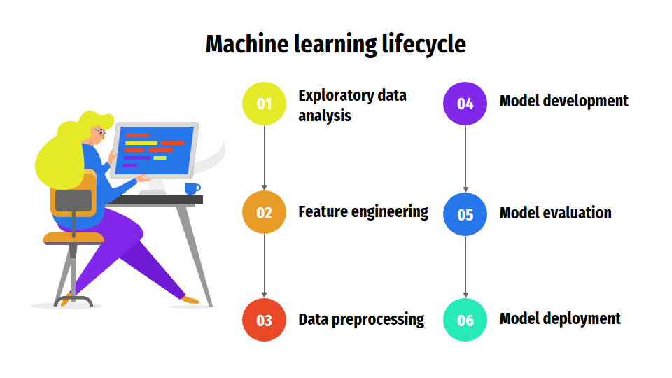
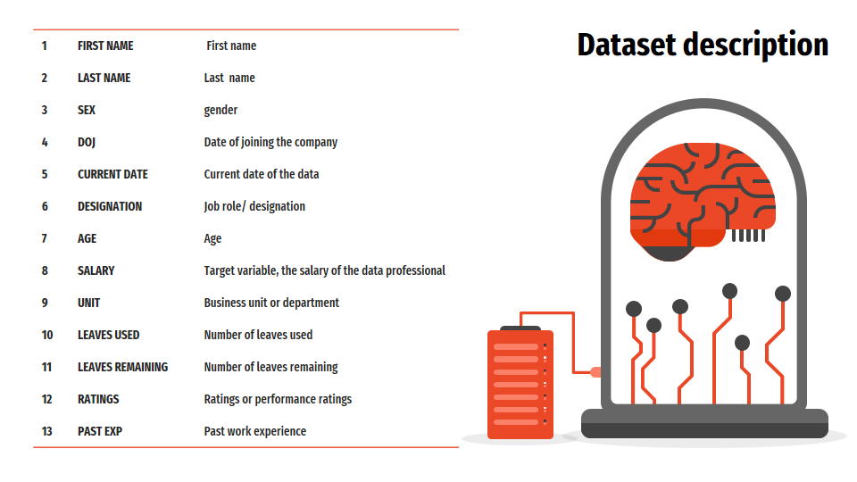
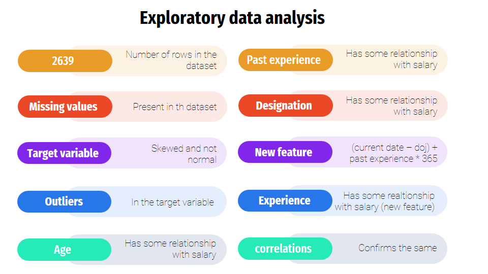
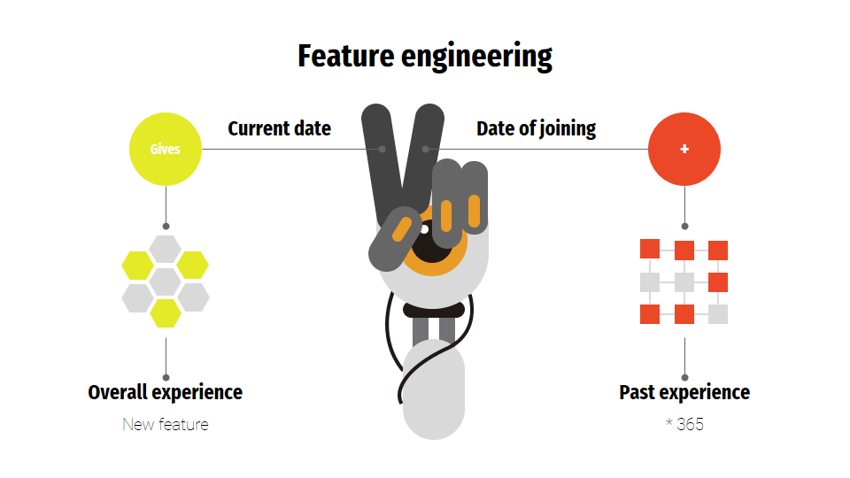
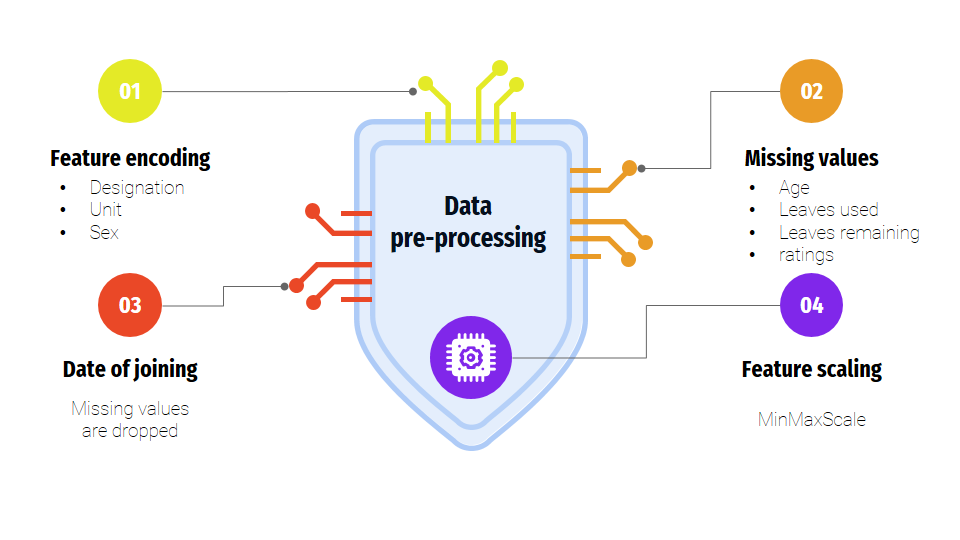
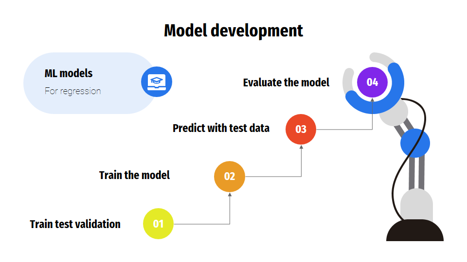
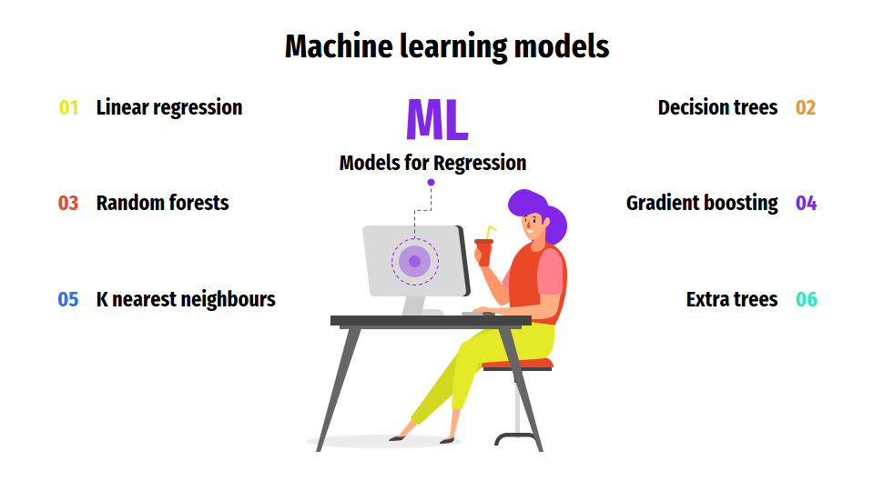
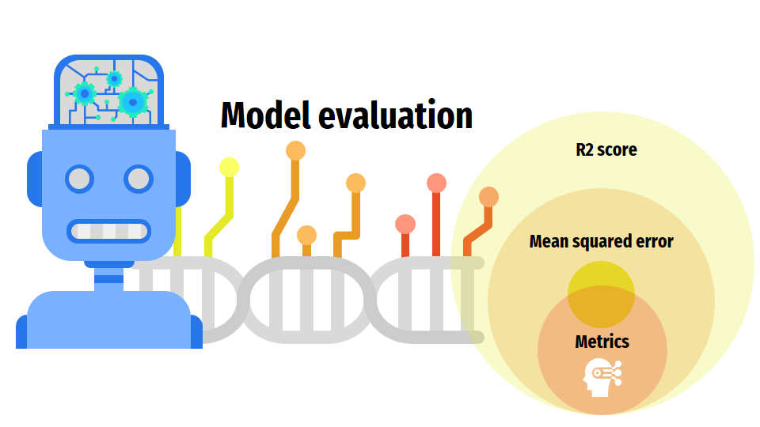
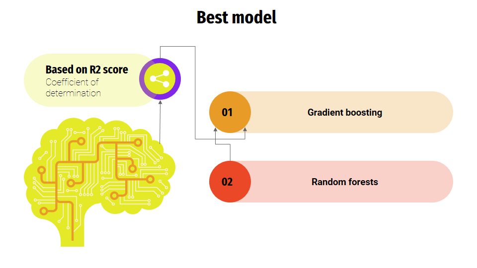
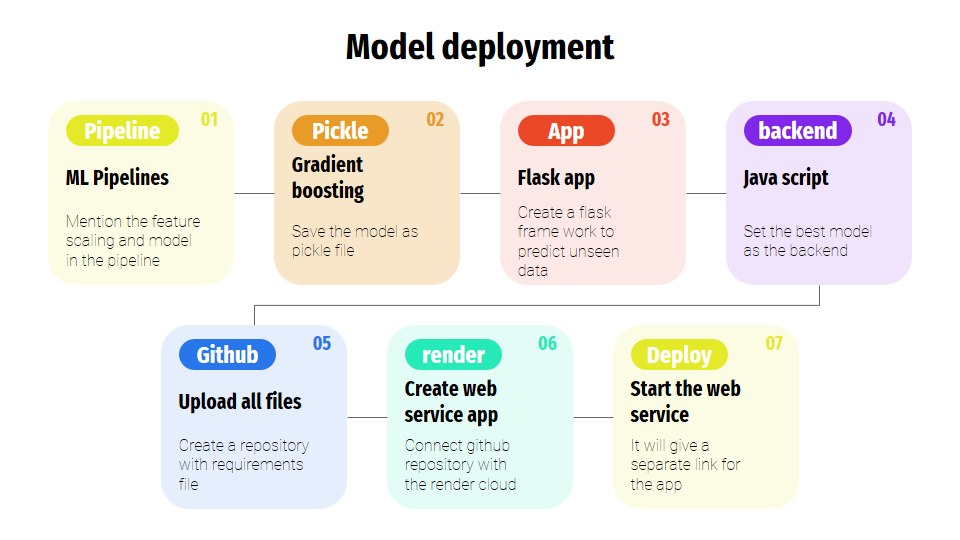
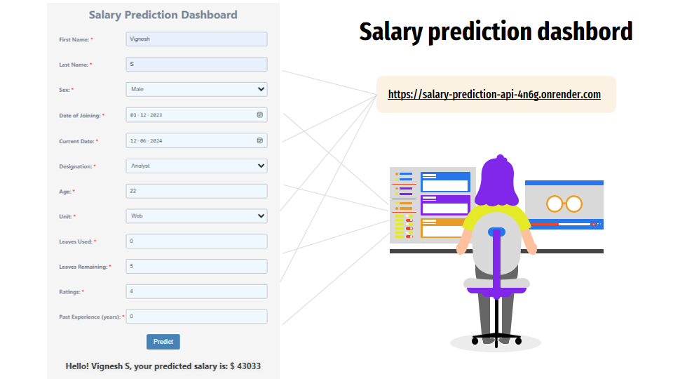

## 🤝 Contributing

Contributions are welcome! Please feel free to submit a Pull Request.

## 🙏 Acknowledgments

This project was completed as part of a machine learning internship focused on predicting salaries of data professionals. Special thanks to the internship providers for giving me this woonderful oppurtunity

---

Feel free to explore the repository, experiment with the models, and improve upon the work done. Your contributions can help in providing valuable insights for job seekers and employers in the field of data professions.
